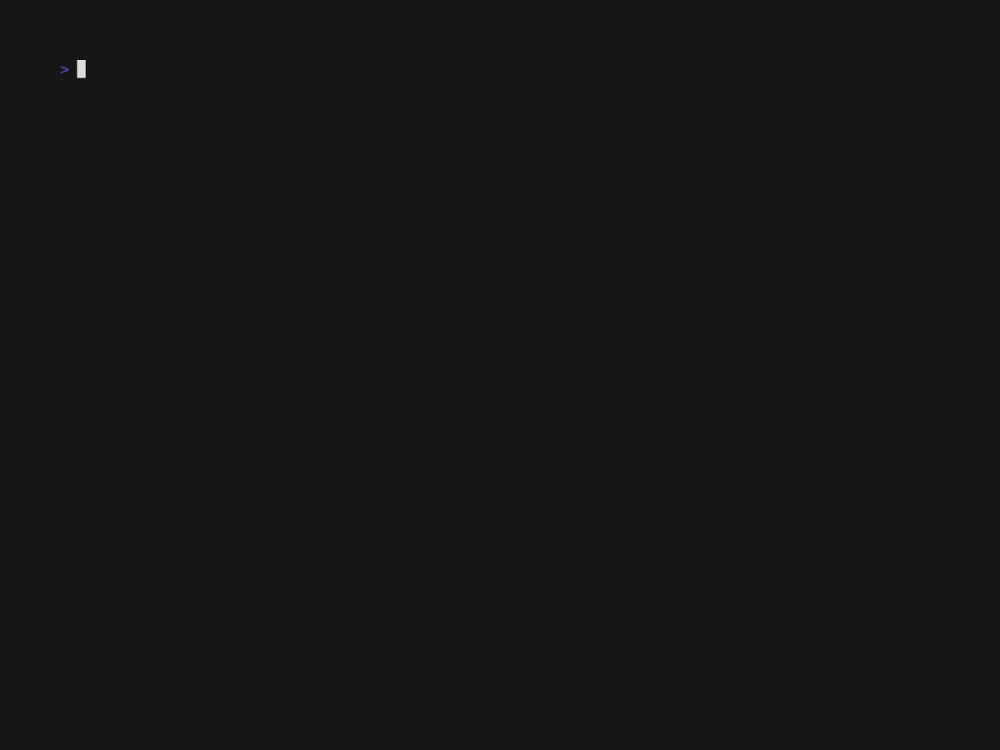

# CS350A Course Project
## λ-calculus interpreter

### Table of Contents

- [Description](#description)
  - [Features](#features)
  - [Code Structure](#code-structure)

- [Usage](#usage)
  - [Demo Example](#demo-example)

- [Team Members](#team-members)

## Description

An interpreter for λ-calculus implemented in `ruby`, as part of our course project CS350A: Principles of Programming Languages under Prof. Satyadev Nandakumar, in Fall Semester 2022-23, IIT Kanpur.

The grammar specification is:
```
λ − term ::= variable |
            (\variable · λ − term) |
            [λ − term][λ − term]

The allowed variables are single lowercase English letters - a, b, c etc.
```

### Features

It supports the following features:

- [x] Lexer and grammar checker for lambda term expression using LL(1) parser
- [x] Determine free variables in given lambda term
- [x] Free variables substitution
- [x] Alpha Renaming and Beta Reduction

### Code Structure

```bash
.
├── assets/
├── lexer.rb
├── LICENSE
├── main.rb
├── parser.rb
├── README.md
├── reducer.rb
├── tests/
└── utils.rb

2 directories, 14 files
```

## Usage

Keep your λ-expression in a file and pass its filepath as an argument to `main.rb`.

```bash
Lambda Calculus Interpreter
===========================
Usage: main.rb [options]
    -i, --input FILE                 Input file containing λ-expression
    -o, --output FILE                (Optional) Output file to store reduced λ-expression. Default: out.txt
```

### Demo Example

**Note** that we use the notation of `v{i}`, where `i := [1,2,3,...]` for our bound variables after the processing of alpha-renaming and beta-reduction. This helps in easily identifying the bound variables and keep their count in the final reduced form.



```bash
$ ruby main.rb -i tests/9.lc ## or
$ ruby main.rb --input=tests/9.lc

================
Course Project
Lambda Calculus Interpreter
Created by: Ayush, Gurbaaz and Kritin
================
Grammar checker :- 
[ ( \ x . x ) ] [ y ] is a valid lambda term
================
Free variables :- y 
================
α-renaming :- [ ( \ v0 . v0 ) ] [ y ]
================
> Please provide the free variable name along with its substitution. e.g. x:=M denotes replacing free occurences of x with lambda term M
> or press ENTER to finish
y:=(\x.x)
Free variable substitution :- [ ( \ v1 . v1 ) ] [ ( \ v2 . v2 ) ]
================
> All free variables have been substituted successfully! (Closed Form)
Exiting...
================
β-reduction :- 
Step 1. ( \ v2 . v2 )
No further reduction possible!
================
Final β-reduced form '( \ v2 . v2 )' saved to 'out.txt'
================
```

You may find some of the lambda expression files in `tests/` directory.

## Team Members

1. Ayush Kumar (190213)
2. Gurbaaz Singh Nandra (190349)
3. Kritin Sharma (190440)
